# PRNet-keras
Implementation in Keras of PRNet (Joint 3D Face Reconstruction and Dense Alignment with Position Map Regression Network, published in ECCV 2018) includes: training and evaluation for model, HTTP Server for request 3d reconstruction result.  
This is an unofficial implementation.

Original Paper: &nbsp; [Arxiv](https://arxiv.org/abs/1803.07835) &nbsp; [ECCV2018](http://openaccess.thecvf.com/content_ECCV_2018/papers/Yao_Feng_Joint_3D_Face_ECCV_2018_paper.pdf)

Offical Implementation: &nbsp; [PyTorch](https://github.com/YadiraF/PRNet)

****

## Contents

* [Installation](#Installation)
* [Training](#Training)
* [Evaluating](#Evaluating)
* [Testing](#Testing)
* [References](#References)


## Installation

Create a new python virtual environment by [Anaconda](https://www.anaconda.com/) or just use pip in your python environment and then clone this repository as following.

### Clone this repo
```bash
git clone git@https://github.com/kameo4189/PRNet-keras.git
cd PRNet-keras
```

### Conda
```bash
conda create --name PRNet-keras --file requirements.txt
conda activate PRNet-keras
```

### Pip

```bash
pip install -r requirements.txt
```


****

## Training

### Training data
The implementation use [300W-LP](http://www.cbsr.ia.ac.cn/users/xiangyuzhu/projects/3DDFA/main.htm) as training data and [AFLW2000-3D](http://www.cbsr.ia.ac.cn/users/xiangyuzhu/projects/3DDFA/Database/AFLW2000-3D.zip) as evaluation data, same as in the original paper. 

### Build HDF5 dataset
The training process doesn't use image and mat files directly form above datasets, you need to zip these image and mat files to HDF5 file.
You can download created HDF5 dataset for train and val from [here](https://drive.google.com/drive/folders/11AsRtIo4fj7-9UneeAfHP3Mw0ZS4GrtK?usp=sharing):
* train.hdf5: created from 300W-LP dataset 
* val.hdf5: created from AFLW2000-3D dataset.  

To create HDF5 dataset manually, you need to run *build_dataset.py* with arguments as below:
* batch: number of images from dataset for processing at each loop
* bufsize: number of images from dataset for write to disk 
* zipDir: folder path contains downloaded zip dataset file (optional, no need when specify extracted path in extractdir argument)
* extractdir: folder path contains extracted dataset file (parent folder of folder that extracted from zip dataset file)
* hdf5dir: folder path to output HDF5 dataset result
* buildmode: specify train or val to build, refer DATASET_ZIP_NAMES, DATASET_DIRS, DATASET_MODES in file *configure/config_training.py*
* extenddata: optional, get extended data or not. If True, it will get all data folder that contain specfied mode (refer logic code and DATASET_MODES)
* datamode: specify data for writing to disk, refer DATA_TYPE_MODES in file *configure/config.py*. Default data type is byte for saving disk space purpose, only raw file in disk is writing to HDF5 file (not read content to numpy array).

##### Run building

```bash
python build_dataset.py ...
```

### Training model
Model structure in Keras is defined at *model\nn\conv\position_map_regression.py*.
Run file *train_model.py* to train the model, some main arguments as below:
* epochs: number of epochs
* batchsize: size of training batch
* model: specify model path to restart training
* start_epoch: epoch number to restart training at
* learningrate: initial learning rate, default is 1e-4 (learning scheduler defined in method custom_lr_scheduler)
* lossfunct: sepcify loss function, default is mean squared error (some loss functions defined at *model\nn\conv\position_map_regression.py*)
* hdf5dir: specify folder path contains train.hdf5 and val.hdf5

Refer file *generating\image_uvmap_sequence_generator.py* for processing of augmenting and generating pairs of image and uvmap.
All result of training process is output to folder output_\<learningrate\>\_\<lossfunct\>. The best eval loss model is outputted at file output_\<learningrate\>\_\<lossfunct\>\best_eval_loss.model

##### Run training

```bash
python train_model.py --epochs 100 --batchsize 16 --learningrate 1e-4 ...
```

##### Training result <a name="training_result"></a>
Loss result for model after trained with configure: batch size 16, initial learning rate 1e-4 and augment same as original paper.  
The min eval loss is reached at epoch 73.  
Graph of train loss and eval loss  
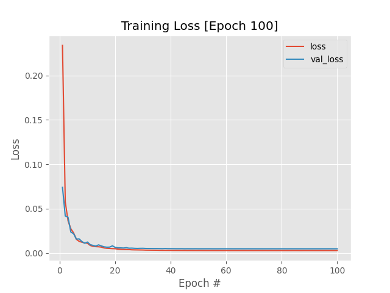

## Evaluating
The trained model is evaluated on AFLW2000-3D with evaluation type and metric same as original paper.
Evaluation type includes (refer original paper for more detail):
* 2D Sparse Alignment: NME (normalize mean error) on 2D coordinates of vertices of 68 landmarks
* 2D Dense Alignment: MNE on 2D coordinates of all vertices of face
* 3D Sparse Alignment: NME on 3D coordinates of vertices of 68 landmarks
* 3D Dense Alignment: MNE on 3D coordinates of all vertices of face
* 2D Face Reconstruction: NME on 2D coordinates of all vertices of face after run ICP (Iterative Closest Point)
* 3D Face Reconstruction: MNE on 3D coordinates of all vertices of face after run ICP

Run file *evaluate_model.py* to evaluate trained model with some main arguments as below:
* modeldir: path to folder contain model
* datadir: path to validation dataset folder
* hdf5: path to validation HDF5 dataset (when hdf5 is specified, datadir is ignored)
* outputdir: path for output validation result
* evalidxs: specify evaluation type for running (refer EVALUATION_TYPES in *configure\config_evaluating.py*)
* serverlog: logging output print to remote server or not (optional, need to run file *logger_server.py* when turn on, I create this mode to be able tracking progress when running on kaggle)
* shiftZ: with coordinates of predicted vertives, shift value of Z axis to have min = 0 before evaluating. The result will be more accuracy when shifting value of Z axis to have min = 0 and compare with original vertices (also already shifted to have min Z = 0).

##### Run evaluating

```bash
python evaluate_model.py --evalidxs 0 1 2 3 4 5 --serverlog 0 --shiftZ 1 ...
```

##### Evaluating result
Evaluating result of min eval loss model in [Training result](#training_result)  
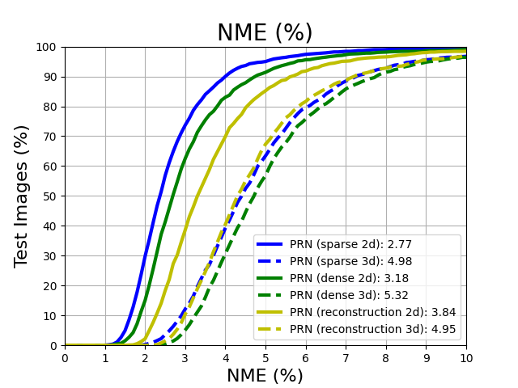  
Above evaluating result is fine but isn't good as result in original paper.

## Testing

#### 1. Test on image
For testing with image, I implemented application for display uvmap, restored point cloud (using pptk libary) and restored mesh (using open3d library).  
Trained model can be download [here](https://drive.google.com/file/d/11OrU4Pyk5LlfaQ_z7BkC2BzGKj2OSb9y/view?usp=sharing), please extract it in to any folder and specify this path to argument.  
Run file *load_model.py* to test trained model with arguments as below:
* image: path to image for testing
* model: path to trained model

```bash
python load_model.py --image <testing image path> --model <model path>
```
  
##### Example result
|UV position map|2D Alignment|Mesh|PointCloud|
|---------------|------------|----|----------|
|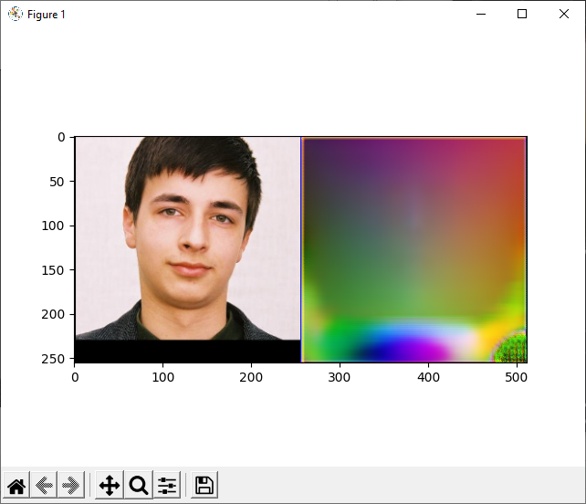|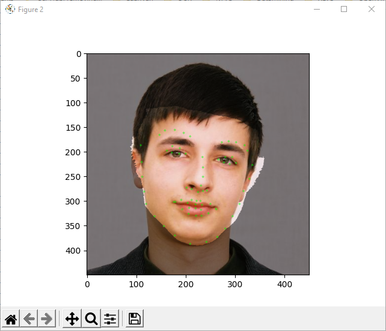||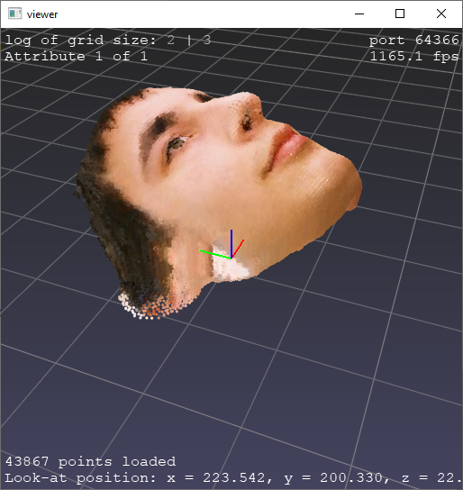|
|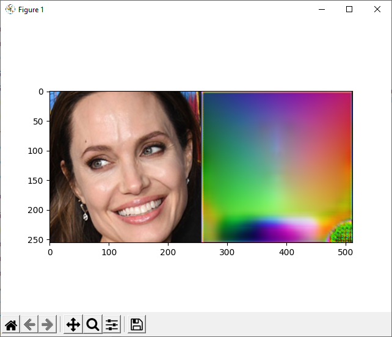|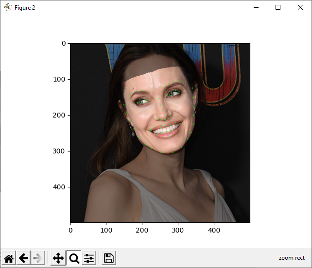|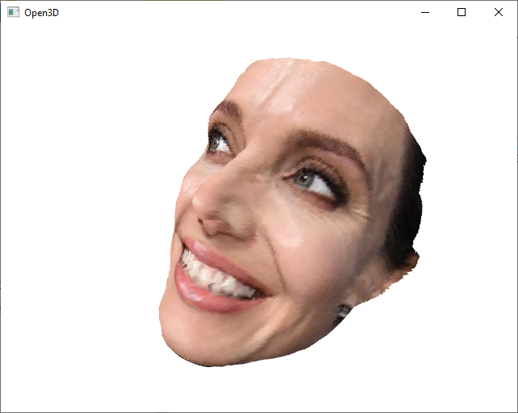|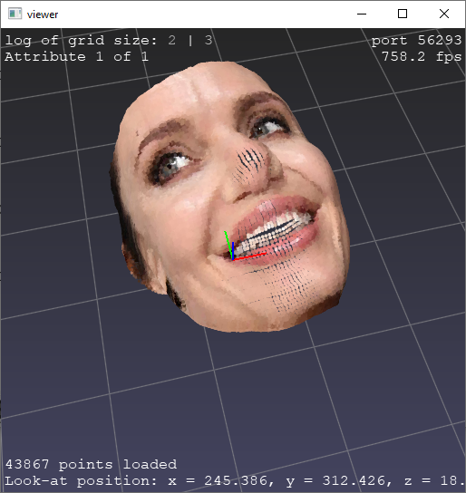|
|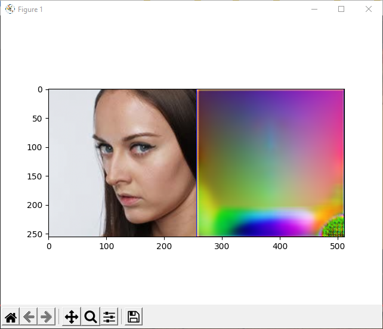|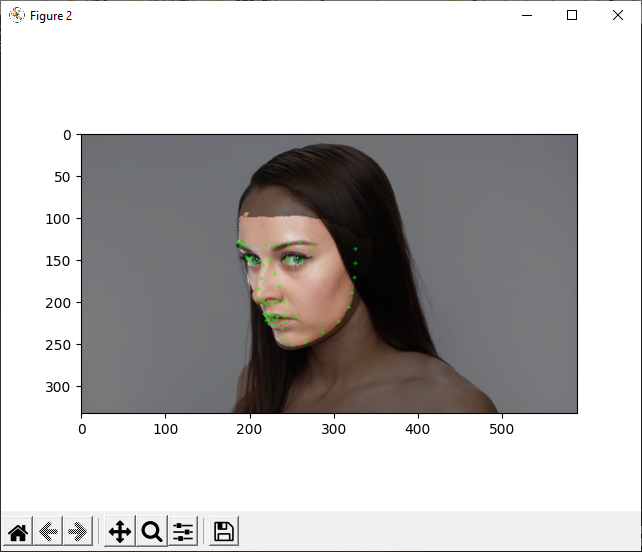|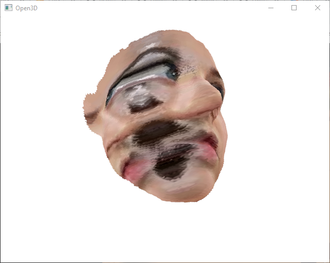|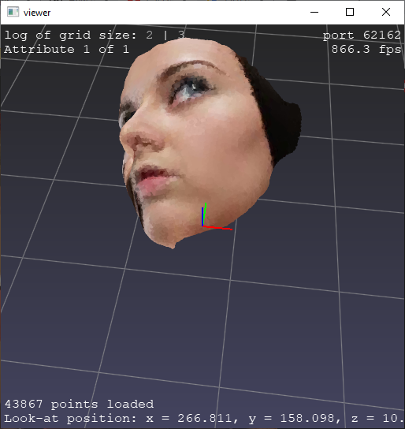|
