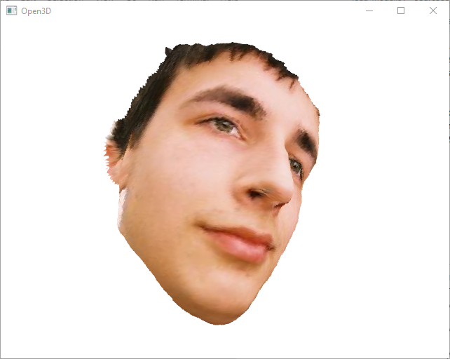

# PRNet-keras
Implementation in Keras of PRNet (Joint 3D Face Reconstruction and Dense Alignment with Position Map Regression Network, published in ECCV 2018) includes: training and evaluation for model, HTTP Server for request 3d reconstruction result.  
This is an unofficial implementation.

Original Paper: &nbsp; [Arxiv](https://arxiv.org/abs/1803.07835) &nbsp; [ECCV2018](http://openaccess.thecvf.com/content_ECCV_2018/papers/Yao_Feng_Joint_3D_Face_ECCV_2018_paper.pdf)

Offical Implementation: &nbsp; [PyTorch](https://github.com/YadiraF/PRNet)

****

## Contents

* [Installation](#Installation)
* [Training](#Training)
* [Evaluating](#Evaluating)
* [Testing](#Testing)
* [References](#References)


## Installation

Create a new python virtual environment by [Anaconda](https://www.anaconda.com/) or just use pip in your python environment and then clone this repository as following.

### Clone this repo
```bash
git clone git@https://github.com/kameo4189/PRNet-keras.git
cd PRNet-keras
```

### Extracting zip
* Extracting file *resource/BFM/BFM.zip.001* to *resource/BFM* folder.

### Conda
```bash
conda create --name PRNet-keras --file requirements.txt
conda activate PRNet-keras
```

### Pip

```bash
pip install -r requirements.txt
```

****

## Training

### Training data
The implementation use [300W-LP](http://www.cbsr.ia.ac.cn/users/xiangyuzhu/projects/3DDFA/main.htm) as training data and [AFLW2000-3D](http://www.cbsr.ia.ac.cn/users/xiangyuzhu/projects/3DDFA/Database/AFLW2000-3D.zip) as evaluation data, same as in the original paper. 

### Build HDF5 dataset
The training process doesn't use image and mat files directly form above datasets, you need to zip these image and mat files to HDF5 file.
You can download created HDF5 dataset for train and val from [here](https://drive.google.com/drive/folders/11AsRtIo4fj7-9UneeAfHP3Mw0ZS4GrtK?usp=sharing):
* train.hdf5: created from 300W-LP dataset 
* val.hdf5: created from AFLW2000-3D dataset.  

To create HDF5 dataset manually, you need to run *build_dataset.py* with arguments as below:
* batch: number of images from dataset for processing at each loop
* bufsize: number of images from dataset for write to disk 
* zipDir: folder path contains downloaded zip dataset file (optional, no need when specify extracted path in extractdir argument)
* extractdir: folder path contains extracted dataset file (parent folder of folder that extracted from zip dataset file)
* hdf5dir: folder path to output HDF5 dataset result
* buildmode: specify train or val to build, refer DATASET_ZIP_NAMES, DATASET_DIRS, DATASET_MODES in file *configure/config_training.py*
* extenddata: optional, get extended data or not. If True, it will get all data folder that contain specfied mode (refer logic code and DATASET_MODES)
* datamode: specify data for writing to disk, refer DATA_TYPE_MODES in file *configure/config.py*. Default data type is byte for saving disk space purpose, only raw file in disk is writing to HDF5 file (not read content to numpy array).

##### Run building

```bash
python build_dataset.py --batch 200 --bufsize 1000 --extractdir <path to dir contained extracted dataset dir> --hdf5dir <path to output dir> --buildmode <train|val> --datamode 5
```

### Training model
Model structure in Keras is defined at *model\nn\conv\position_map_regression.py*.
Run file *train_model.py* to train the model, some main arguments as below:
* epochs: number of epochs
* batchsize: size of training batch
* model: specify model path to restart training
* start_epoch: epoch number to restart training at
* learningrate: initial learning rate, default is 1e-4 (learning scheduler defined in method custom_lr_scheduler)
* lossfunct: sepcify loss function, default is mean squared error (some loss functions defined at *model\nn\conv\position_map_regression.py*)
* hdf5dir: specify folder path contains train.hdf5 and val.hdf5

Refer file *generating\image_uvmap_sequence_generator.py* for processing of augmenting and generating pairs of image and uvmap.
All result of training process is output to folder output_\<learningrate\>\_\<lossfunct\>. The best eval loss model is outputted at folder output_\<learningrate\>\_\<lossfunct\>\best_eval_loss.model

##### Run training

```bash
python train_model.py --epochs 100 --batchsize 16 --learningrate 1e-4 --lossfunct wtmse --hdf5dir <path to dir contain HDF5 datasets>
```

##### Training result <a name="training_result"></a>
Loss result for model after trained with configure: batch size 16, initial learning rate 1e-4 and augment same as original paper.  
The min eval loss is reached at epoch 73.  
Graph of train loss and eval loss  


## Evaluating
The trained model is evaluated on AFLW2000-3D with evaluation type and metric same as original paper.
Evaluation type includes (refer original paper for more detail):
* 2D Sparse Alignment: NME (normalize mean error) on 2D coordinates of vertices of 68 landmarks
* 2D Dense Alignment: MNE on 2D coordinates of all vertices of face
* 3D Sparse Alignment: NME on 3D coordinates of vertices of 68 landmarks
* 3D Dense Alignment: MNE on 3D coordinates of all vertices of face
* 2D Face Reconstruction: NME on 2D coordinates of all vertices of face after run ICP (Iterative Closest Point)
* 3D Face Reconstruction: MNE on 3D coordinates of all vertices of face after run ICP

Run file *evaluate_model.py* to evaluate trained model with some main arguments as below:
* modeldir: path to folder contain model
* datadir: path to validation dataset folder
* hdf5: path to validation HDF5 dataset (when hdf5 is specified, datadir is ignored)
* outputdir: path for output validation result
* evalidxs: specify evaluation type for running (refer EVALUATION_TYPES in *configure\config_evaluating.py*)
* serverlog: logging output print to remote server or not (optional, need to run file *logger_server.py* when turn on, I create this mode to be able tracking progress when running on kaggle)
* shiftZ: with coordinates of predicted vertives, shift value of Z axis to have min = 0 before evaluating. The result will be more accuracy when shifting value of Z axis to have min = 0 and compare with original vertices (also already shifted to have min Z = 0).

##### Run evaluating

```bash
python evaluate_model.py --modeldir <path to model> --hdf5 <path to val.hdf5> --batchsize 10 --outputdir <path to output dir> --evalidxs 0 1 2 3 4 5 --serverlog 0 --shiftZ 1
```

##### Evaluating result
Evaluating result of min eval loss model in [Training result](#training_result)  
  
Above evaluating result is fine but isn't good as result in original paper.

## Testing

#### 1. Test on image
For testing with image, I implemented application for display uvmap, restored point cloud (using pptk libary) and restored mesh (using open3d library).  
Trained model can be download [here](https://drive.google.com/file/d/11OrU4Pyk5LlfaQ_z7BkC2BzGKj2OSb9y/view?usp=sharing), please extract it in to any folder and specify this path to argument.  
Run file *load_model.py* to test trained model with arguments as below:
* image: path to image for testing
* model: path to trained model

```bash
python load_model.py --image <testing image path> --model <model path>
```
  
##### Example results
|UV position map|2D Alignment|Mesh|PointCloud|
|---------------|------------|----|----------|
|||||
|||||
|||||

#### 2. Demo with HTTP server
To make it convenient, I created a HTTP server that using RestfulAPI for requesting restored mesh on both local and the internet (using [ColabCode](https://github.com/abhishekkrthakur/colabcode) library).  
 
#### Run server
```bash
python load_model_server.py --model <model path>
```  

Example of output when run server on terminal.  
Local url and internet url are outputed at below:  
  *Public URL: NgrokTunnel: "https://1f5e-14-161-7-170.ngrok.io" -> "http://localhost:20000"*  
  
Refer file *load_model_client.py* for implementation of request on python code.  
Refer my github [Face3DReconstruction](https://github.com/kameo4189/Face3DReconstruction) for implementation of request on C# code.  

#### APIs
Attention is these APIs of server receive and send files that are converted to string and put inside json body. When receiving files by json, you need to convert files back from string type.  
To convert a file to string, you need to read all file to byte array and convert to its equivalent string representation that is encoded with base-64 digits.  
  |Language|Source Code|
  |--------|-----------|
  |Python|``` base64Str = base64.b64encode(byteArray).decode() ```|
  |C#|``` string base64Str = Convert.ToBase64String(byteArray); ```|
 
To convert a string back to file, byte array of file content is get from an 8-bit unsigned integer array, which is equivalent to base-64 digits encoded string.
  |Language|Source Code|
  |--------|-----------|
  |Python|``` byteArray = base64.b64decode(base64Str) ```|
  |C#|``` byte[] byteArray = Convert.FromBase64String(base64Str); ```|
  
An output mesh is get from response is a mat file which is converted to string, this mat file contains variables as below:
* vertices: array of coordinates of vertices, shape is [number of vertices, 3], data type is float.
* colors: array of colors of vertices, shape is [number of vertices, 3], data type is float.
* full_triangles: array of triangle indexes, shape is [number of triangles, 3], data type is int.
* vertex_normals: array of normals of vertices, shape is [number of vertices, 3], data type is float.
* kptIdxs: array of indexes of keypoints, shape is [number of vertices], data type is int.
* bounding_box: array of min and max values of each axis, shape is [6], data type is float.  

For reading mesh file result, you need to use the library that can reading "\*.mat" file.  
In python, you can use [scipy.io.loadmat](https://docs.scipy.org/doc/scipy/reference/generated/scipy.io.loadmat.html).  
In C# .NET, you can use [MatFileHandler](https://github.com/mahalex/MatFileHandler). 

1. Path: "/"
    * Description: The root-endpoint of the API
    * Type: GET
    * Output: 
    ```json 
    { "message": "This is the homepage of the PRNet API" }
    ```
2. Path: "/extract"
    * Description: Get 3D mesh from 2D images and original mat files
    * Type: POST
    * Input:  
      * Note: In C#, when reading mat files that are sent from python server, row and column are reverted. Therefore, I adding "matType" field in json to mark for some processing in python server before sending file that make the reading in C# correctly.
    
    ```json 
    { 
      "matType": "<normal or dotnet>", 
      "imageMatList": [
          {
            "rawImage": "<string converted from image file 1>",
            "rawMats": ["<string converted from mat file 1 of image file 1>", "<string converted from mat file 2 of image file 1>", ...]
          },
          {
            "rawImage": "<string converted from image file 2>",
            "rawMats": ["<string converted from mat file 1 of image file 2>", "<string converted from mat file 2 of image file 2>", ...]
          },
          ...
      ] 
    }
    ```
    * Output: 
    ```json 
    { 
      "imageMeshList": [
        "faceMeshList": [
          {
            "rawMesh": "<string converted from mesh mat file 1 of image file 1>",
            "faceBB": ["<center of X>", "<center of Y>", "<size of bounding box>"]
          },
          {
            "rawMesh": "<string converted from mesh mat file 2 of image file 1>",
            "faceBB": ["<center of X>", "<center of Y>", "<size of bounding box>"]
          }
          ...
         ],
        "faceMeshList": [
          {
            "rawMesh": "<string converted from mesh mat file 1 of image file 2>",
            "faceBB": ["<center of X>", "<center of Y>", "<size of bounding box>"]
          },
          {
            "rawMesh": "<string converted from mesh mat file 2 of image file 2>",
            "faceBB": ["<center of X>", "<center of Y>", "<size of bounding box>"]
          }
          ...
         ],
         ...
      ]
    }
    ```
3. Path: "/predict"
    * Description: Get 3D face mesh from 2D images
    * Type: POST
    * Input: same as Input for path "/extract", put empty string in rawMats when not existing mat files for images.
    * Output: same as Output for path "/extract"
4. Path: "/evaluate"
    * Description: Get evaluation result between predicted mesh and original mesh
    * Type: POST
    * Input: 
    ```json 
    { 
      "imageMatList": [
          {
            "rawImage": "<string converted from image file 1>",
            "rawOrgMats": ["<string converted from org mat file 1 of image file 1>", "<string converted from org mat file 2 of image file 1>", ...]
            "rawPredictMats": ["<string converted from predicted mat file 1 of image file 1>", "<string converted from predicted mat file 2 of image file 1>", ...]
          },
          {
            "rawImage": "<string converted from image file 2>",
            "rawOrgMats": ["<string converted from org mat file 1 of image file 2>", "<string converted from org mat file 2 of image file 2>", ...]
            "rawPredictMats": ["<string converted from predicted mat file 1 of image file 2>", "<string converted from predicted mat file 2 of image file 2>", ...]
          },
          ...
      ] 
    }
    ```
    * Output: 
    ```json 
    { 
      "evaluationTypes": ["sparse 2D", "sparse 3D", "dense 2D", "dense 3D", "reconstruction 2D", "reconstruction 3D"],
      "evaluationDataList": [
        "imageEvalValues": [
          "evalValues": ["<sparse 2D value>", "<sparse 3D value>", "<dense 2D value>", "<dense 3D value>", "<reconstruction 2D value>", "<reconstruction 3D value>"],
          "evalValues": ["<sparse 2D value>", "<sparse 3D value>", "<dense 2D value>", "<dense 3D value>", "<reconstruction 2D value>", "<reconstruction 3D value>"],
          ...
        ],
        "imageEvalValues": [
          "evalValues": ["<sparse 2D value>", "<sparse 3D value>", "<dense 2D value>", "<dense 3D value>", "<reconstruction 2D value>", "<reconstruction 3D value>"],
          "evalValues": ["<sparse 2D value>", "<sparse 3D value>", "<dense 2D value>", "<dense 3D value>", "<reconstruction 2D value>", "<reconstruction 3D value>"],
          ...
        ],
        ...
      ]
    }
    ```
    
## References
Thanks for these source codes and libraries helping me to complete this repository.

- https://github.com/YadiraF/PRNet (Official)
    - PRNet architecture and API.
- https://github.com/YadiraF/face3d
    - Dataset generaton for position maps.
- https://github.com/abhishekkrthakur/colabcode
- https://fastapi.tiangolo.com/
    - Libraries for creating HTTP server for both local and internet
- http://www.open3d.org/
- https://github.com/heremaps/pptk
    - Libraries for displaying 3D face result
- https://github.com/pglira/simpleICP
    - Implementation of Iteractive Closest Point.
- https://github.com/yu4u/cutout-random-erasing
    - Implementation of noise texture adding into raw images for synthesizing occlusions.
- https://github.com/1adrianb/2D-and-3D-face-alignment/blob/master/utils.lua
- https://github.com/AaronJackson/vrn/issues/88
    - Implementation of evaluation with Normalize Mean Error metric.
